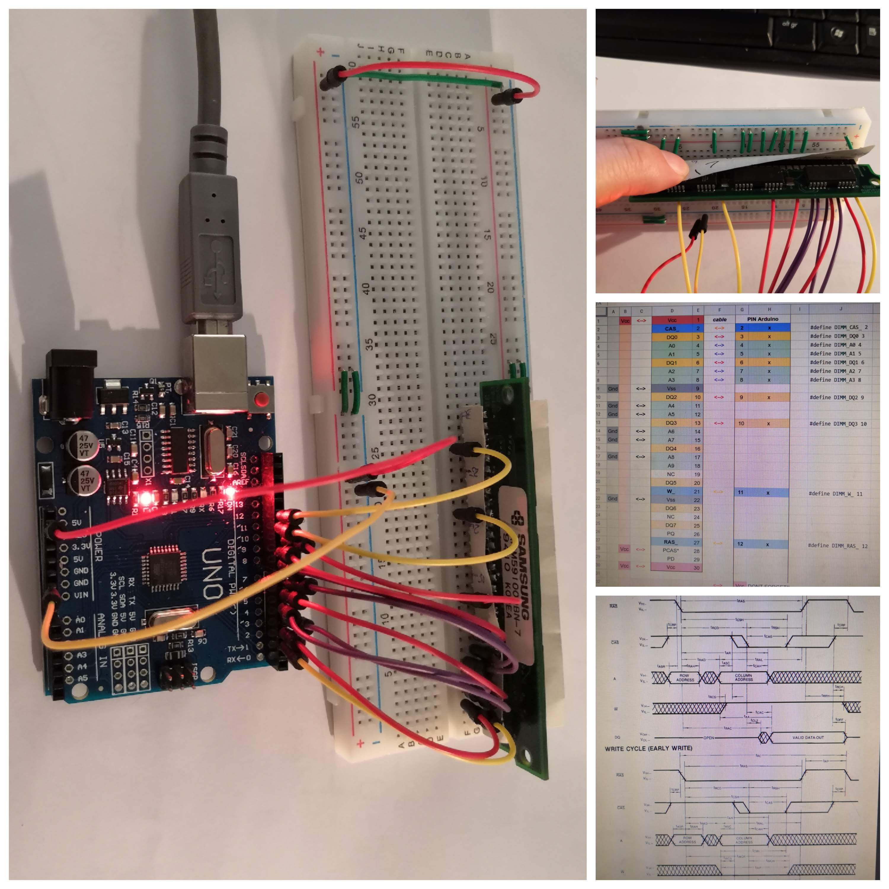
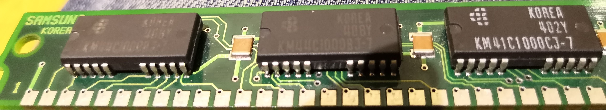

- [Drive a DRAM module with Arduino](#drive-a-dram-module-with-arduino)
  - [Reference Material](#reference-material)
  - [Circuit](#circuit)
  - [Code](#code)
- [Todo & next steps](#todo--next-steps)
- [Thanks](#thanks)

# Drive a DRAM module with Arduino

In this project I'm driving an old 1MB DRAM SIMM memory module with an Arduino Uno board.




The module I use is a KMM591000BN-7 manufactured by Samsungs Electronics in 10/1994.

It consists of two KM44C1000BJ 1Mx4 modules, and one KM41C1000CJ 1Mx1, so it has a total capacity of 1M bit x 9: 1M x (8bits + 1 parity bit).

I have soldered a 30-pins male header so I can plug it on a breadboard.

## Reference Material

| Link                                                                 | Description                  | Author               |
| :------------------------------------------------------------------- | ---------------------------- | -------------------- |
| [KMM591000BN](doc/KMM591000BN.pdf)                                   | KMM591000BN-7 Datasheet      | Samsungs Electronics |
| [KM44C1000BJ](doc/km44c1000c-cl-csl.pdf)                             | KM44C1000CJ Datasheet        | Samsungs Electronics |
| [KM44C1000BJ](doc/km41c1000cj-7.pdf)                                 | KM41C1000CJ Datasheet        | Samsungs Electronics |
| [Understanding DRAM Operation](doc/Understanding_DRAM_Operation.pdf) | Understanding DRAM Operation | IBM                  |

## Circuit

### SIMM pins mapping to Arduino pins

We get the pins configuration of the SIMM module from the Datasheet. This is how I choose to map them to the Arduino board.

Due to the limited pin number of the Arduino Uno, I have used 4 bit of address bus (A0 to A3) and 4 bits of Data bus (DQ0 to DQ3):


### Circuit schematics


Shematics available as [Fritzing file](arduino/dram.fzz).

## Code

Code for the [Arduino sketch](arduino/SIMM_KMM591000__4/SIMM_KMM591000__4.ino).

At reset or power up the Arduino should run the DRAM initialization protocol, run some tests that should verify everything is wired correctly, then show a memory dump, and show the instructions:

```
DRAM Initialization
Test 1
Test 2
Test 3

Memory dump:

   0 1 2 3 4 5 6 7 8 9 A B C D E F 
0: F F F F F F F F F F F F F F F F 
1: F F F F F F F F F F F F F F F F 
2: F F F F F F F F F F F F F F F F 
3: F F F F F F F F F F F F F F F F 
4: F F F F F F F F F F F F F F F F 
5: F F F F F F F F F F F F F F F F 
6: F F F F F F F F F F F F F F F F 
7: F F F F F F F F F F F F F F F F 
8: F F F F F F F F F F F F F F F F 
9: F F F F F F F F F F F F F F F F 
A: F F F F F F F F F F F F F F F F 
B: F F F F F F F F F F F F F F F F 
C: F F F F F F F F F F F F F F F F 
D: F F F F F F F F F F F F F F F F 
E: F F F F F F F F F F F F F F F F 
F: F F F F F F F F F F F F F F F F 

sum=F00
End of tests

Instruction:
w A D: write D(hex) at A(hex)
r A  : read  data at A(hex)
f D  : fill all memory with D
d    : dump memory map (formated)
D    : dump memory, one line
z    : refresh
```

### Writing a value at some address

```
w A5 0
d
```
Should output:

```
Memory dump:

   0 1 2 3 4 5 6 7 8 9 A B C D E F 
0: F F F F F F F F F F F F F F F F 
1: F F F F F F F F F F F F F F F F 
2: F F F F F F F F F F F F F F F F 
3: F F F F F F F F F F F F F F F F 
4: F F F F F F F F F F F F F F F F 
5: F F F F F F F F F F F F F F F F 
6: F F F F F F F F F F F F F F F F 
7: F F F F F F F F F F F F F F F F 
8: F F F F F F F F F F F F F F F F 
9: F F F F F F F F F F F F F F F F 
A: F F F F F 0 F F F F F F F F F F 
B: F F F F F F F F F F F F F F F F 
C: F F F F F F F F F F F F F F F F 
D: F F F F F F F F F F F F F F F F 
E: F F F F F F F F F F F F F F F F 
F: F F F F F F F F F F F F F F F F 

sum=EF1

```

# Todo & next steps

- [x] ~~Implement RAM refresh~~
- [x] ~~Implement different Row/Col addresses~~
- [ ] Implement Fast page writing/reading
- [ ] Use all address and data with, either:
  - [ ] serializing input/output with shift-registers (would reduce pins necesarry, but would slow the operation)
  - [ ] using an Arduino Mega (more GPIO pins)
- [ ] Use Arduino [port registers manipulation](https://www.arduino.cc/en/Reference/PortManipulation) to operate the DRAM
  - May need to reorganize the pins to put each DRAM bus on the same port register of the Arduino, to be able to assert all the pins of a same bus at the same time.

# Thanks

- Thanks to juhannuskameli's blog for [his article](https://juhannuskameli.wordpress.com/2014/01/05/playing-with-arduino-and-dram/), from where I have taken the initial code that I have adapted for this project.

