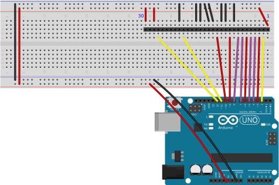

- [Drive a DRAM module with Arduino](#drive-a-dram-module-with-arduino)
  - [Reference Material](#reference-material)
  - [Circuit](#circuit)
  - [Code](#code)
- [Todo & next steps](#todo--next-steps)
- [Thanks](#thanks)

# Drive a DRAM module with Arduino

In this project I'm driving an old 1MB DRAM SIMM memory module with an Arduino Uno board.

The module I use is a KMM591000BN-7 manufactured by Samsungs Electronics: it has a total capacity of 1M bit x 9: 1M x (8bits + 1 parity bit).

It consists of two KM44C1000BJ 1Mx4 modules, and one KM41C1000CJ 1Mx1.

I have soldered a 30-pins male header so I can plug it on a breadboard.

## Reference Material

| Link                                     | Description                  | Author               |
| :--------------------------------------- | ---------------------------- | -------------------- |
| [KMM591000BN](doc/KMM591000BN.pdf)       | KMM591000BN-7 Datasheet      | Samsungs Electronics |
| [KM44C1000BJ](doc/km44c1000c-cl-csl.pdf) | KM44C1000CJ Datasheet        | Samsungs Electronics |
| [KM44C1000BJ](doc/km41c1000cj-7.pdf)     | KM41C1000CJ Datasheet        | Samsungs Electronics |
| [Understanding DRAM Operation]           | Understanding DRAM Operation | IBM                  |

## Circuit

### SIMM pins mapping to Arduino pins

We get the pins configuration of the SIMM module from the Datasheet. This is how I choose to map them to the Arduino board.

Due to the limited pin number of the Arduino Uno, I have used 4 bit of address bus (A0 to A3) and 4 bits of Data bus (DQ0 to DQ3):

### Circuit schematics

Shematics available as [Fritzing file](arduino/dram.fzz).

## Code

See this [first sketch](arduino/DIMM_KMM591000__3/DIMM_KMM591000__3.ino) that writes 0 to 15 (and reads the value) at address 0 to 15.

# Todo & next steps

- Implement Fast page writing/reading
- Use all address and data with, either:
  - serializing input/output with shift-registers (would reduce pins necesarry, but would slow the operation)
  - using an Arduino Mega (more GPIO pins)
- Write 
- Use Arduino [port registers manipulation](https://www.arduino.cc/en/Reference/PortManipulation) to operate the DRAM
  - May need to reorganize the pins to put each DRAM bus on the same port register of the Arduino, to be able to assert all the pins of a same bus at the same time.

# Thanks

- Thanks to juhannuskameli's blog for [his article](https://juhannuskameli.wordpress.com/2014/01/05/playing-with-arduino-and-dram/), from where I have taken the initial code that I have adapted for this project.

